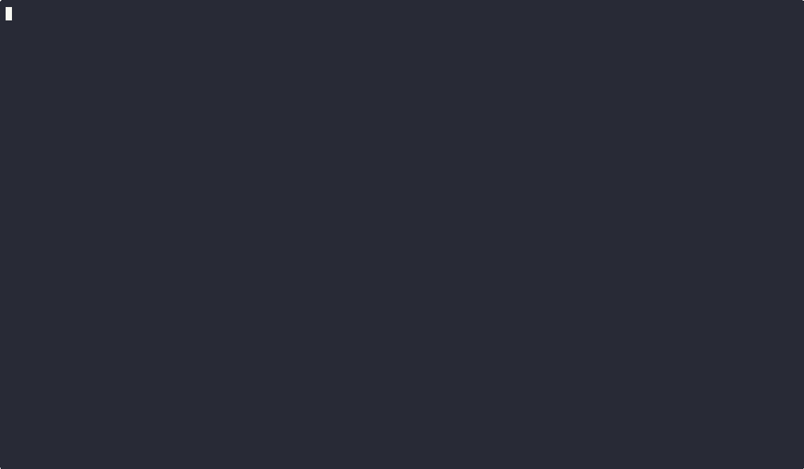

# Stunner

**Stunner** is a small Go CLI tool that sends STUN Binding Requests to multiple Tailscale DERP servers (or any STUN servers you specify) and reports the resulting NAT classification. This helps you determine whether you're behind a **Full Cone**, **Symmetric** NAT, **Restricted**, or otherwise, by analyzing how multiple STUN servers perceive your external IP/port mapping.



## Features

- **Multi-Server STUN**: Queries more than one server (ideally two or more) to detect NAT type accurately.
- **Dynamic DERP Fetching**: If no STUN servers are specified, Stunner can fetch the Tailscale DERP map from `https://login.tailscale.com/derpmap/default` and pick two random servers automatically.
- **NAT Classification**: Provides an overall NAT result, labeling it “Open Internet,” “Full Cone,” “Symmetric NAT,” etc., plus an “Easy” or “Hard” rating for hole punching.
- **Verbose Debug Logging**: An optional `--debug` flag emits debug logs akin to `pystun3`, letting you trace each request/response.
- **Tabular Output**: Results are displayed in tables for easy reading, e.g.:

```
+----------------------------+-------+-----------+---------+
|        STUN SERVER         | PORT  |    IP     | MAPPING |
+----------------------------+-------+-----------+---------+
| derp3d.tailscale.com:3478  | 62236 | <omitted> | UPnP    |
| derp13b.tailscale.com:3478 | 62236 | <omitted> | UPnP    |
+----------------------------+-------+-----------+---------+
+--------+------------------------------+-----------+-------------------------------+
| RESULT |           NAT TYPE           | EASY/HARD |            DETAIL             |
+--------+------------------------------+-----------+-------------------------------+
| Final  | Endpoint-Independent Mapping | Easy      | Endpoint-Independent Mapping. |
+--------+------------------------------+-----------+-------------------------------+
```

## Installation

### OS X

Install from homebrew:

```
brew install jaxxstorm/tap/stunner
```

### Linux

Download the binary from releases


```
VERSION=v0.0.5
cur -L "https://github.com/jaxxstorm/stunner/releases/download/${VERSION}/stunner-${VERSION}-linux-amd64.tar.gz" | tar -xz
./stunner --version
```

## Usage

```bash
Usage: stunner [flags]

Flags:
  -h, --help                                                          Show context-sensitive help.
      --stun-server=STUN-SERVER,...                                   STUN servers to use for detection
      --stun-port=3478                                                STUN port to use for detection
      --source-ip="0.0.0.0"                                           Local IP to bind
      --source-port=INT                                               Local port to bind
      --debug                                                         Enable debug logging
      --software="tailnode"                                           Software to send for STUN request
      --derp-map-url="https://login.tailscale.com/derpmap/default"    URL to fetch DERP map from
      --version                                                       Show version
```

### Common Flags

- **`--stun-server <hostname>`**: Provide one or more STUN servers manually. If you omit this, Stunner fetches two random DERP servers from Tailscale’s map by default.
- **`--stun-port <port>`**: Port used for each STUN server (default 3478).
- **`--source-ip <IP>`** / **`--source-port <port>`**: Local interface IP and port to bind the UDP socket (defaults to `0.0.0.0:54320`).
- **`--debug`**: Enable debug logging, showing STUN transactions and responses.
- **`--software <name>`**: Customize the SOFTWARE attribute in your STUN Binding Request (defaults to `tailnode`).
- **`--derpmapurl <URL>`**: Where to fetch the DERP map JSON if no STUN servers are specified (defaults to `https://login.tailscale.com/derpmap/default`).

### Example

```bash
# Let Stunner fetch DERP servers automatically:
./stunner --debug

# Supply your own STUN servers:
./stunner --stun-server=stun1.l.google.com --stun-server=stun2.l.google.com
```

Stunner will:

1. **Bind** a local UDP socket on the IP/port you specify.
2. **Send** STUN Binding Requests to each server.
3. **Parse** the responses, capturing external IP/port.
4. **Compare** the external ports from each server to classify your NAT as Full Cone, Symmetric, etc.
5. Print results in a **table**.

## Understanding the Output

- **STUN Server**: The server used for the test.
- **Port/IP**: The external port/IP you were mapped to when contacting that server.
- **NAT Type**: The classification for a single test. The “Final” row merges the results from all servers and picks the best guess.
- **Easy/Hard**: Whether the NAT is relatively easy (Full Cone / Restricted) or hard (Symmetric) to penetrate with hole punching.

## Notes & Limitations

- **Experimental**: This is a proof-of-concept. It borrows STUN logic reminiscent of older STUN NAT detection flows and Tailscale’s idea of multi-server tests.
- **Interpretation**: Real NAT environments can be complex. Stunner’s classification is a best effort. Some NAT/firewall behaviors can break these tests.
- **Dependencies**: Go 1.18+ recommended. If building from source, ensure your environment supports modules.

## License

MIT

---

